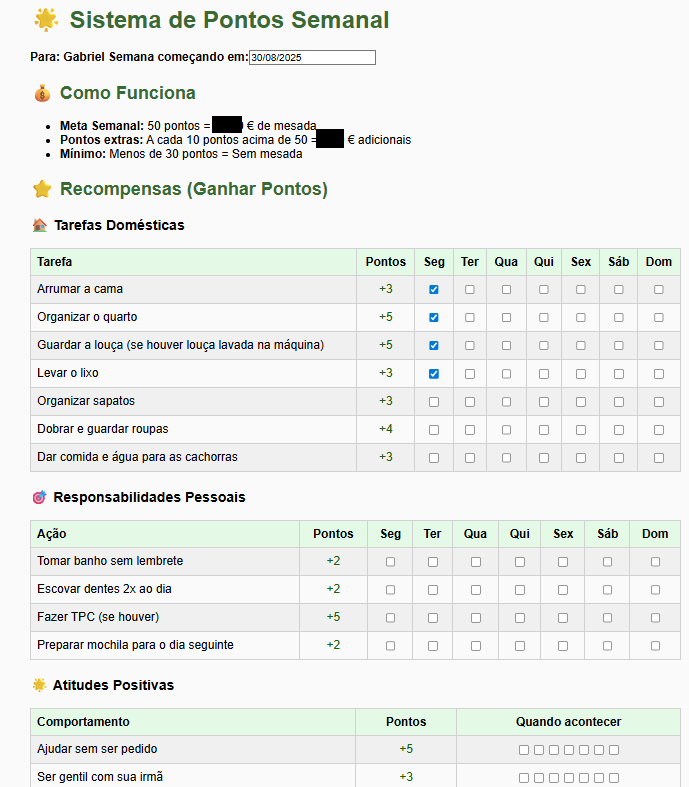
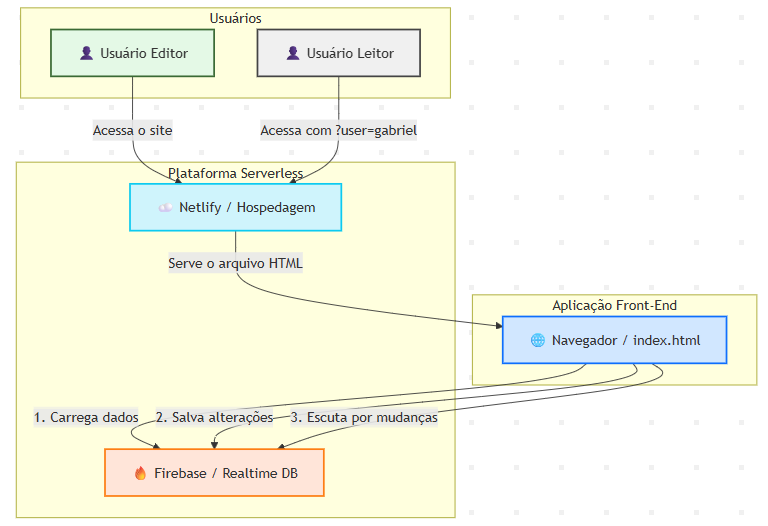

# 🌟 Sistema de Pontos Semanal

<br>

## 🎯 Sobre o Projeto

Este projeto é uma aplicação web interativa e em tempo real para gerenciar um sistema semanal de pontos e recompensas, para as pequenas tarefas domésticas do meu filho. 
Ele foi desenvolvido para ser uma solução prática, 
multi-usuário e *serverless*, eliminando a necessidade de um backend tradicional.

A aplicação permite que usuários "editores" (pais) marquem tarefas e preencham campos, com os dados sendo salvos e sincronizados instantaneamente para 
todos os clientes conectados. Um modo de "apenas leitura" também está disponível para usuários específicos (filho). <br><br>

<br>

Visão geral da aplicação web<br>

---

<br>

## 🚀 Arquitetura e Tecnologias Utilizadas

A solução foi construída com uma abordagem 100% *serverless*, utilizando as seguintes tecnologias:

*   **Front-End:** HTML5, CSS3, JavaScript (Vanilla)
*   **Banco de Dados Real-Time:** [Firebase Realtime Database](https://firebase.google.com/products/realtime-database )
*   **Hospedagem & Deploy:** [Netlify](https://www.netlify.com/ ) <br><br>

<br>

Visão geral da arquitetura<br>

---
<br>

## ✨ Funcionalidades Principais

*   **Sincronização em Tempo Real:** Alterações feitas por um usuário são refletidas instantaneamente para todos os outros.
*   **Persistência de Dados:** Os dados do formulário são armazenados na nuvem (Firebase) e persistem entre sessões.
*   **Controle de Acesso por URL:**
    *   **Modo Edição:** Acesso padrão, permite alterar todos os dados.
    *   **Modo Leitura:** Ativado via parâmetro de URL (`/?user=filho`), desabilita todos os campos para visualização.
*   **Salvamento Automático:** Não há botão "Salvar". Todas as mudanças são salvas automaticamente.
*   **Controles Administrativos:** Um botão para "Limpar a Semana" está disponível apenas para usuários no modo de edição.

---

<br>

## 🛠️ Detalhes Técnicos Aprofundados

Esta seção detalha o funcionamento interno da aplicação, focando na lógica implementada no arquivo `index.html`.

### 1. Conexão e Sincronização com o Firebase

O coração da aplicação é a comunicação em tempo real com o Firebase. Isso é alcançado com duas funções principais:

*   **`dataRef.on('value', callback)`**: Este é o *listener* principal. Ele é executado uma vez no carregamento da página para buscar todos os dados iniciais. A partir daí, ele "escuta" ativamente por qualquer alteração no nó `formData` do banco de dados. Se outro usuário modifica um dado, o Firebase envia o novo estado para todos os clientes conectados, e a função de `callback` (`loadDataFromFirebase`) é disparada para atualizar a interface. Isso garante a sincronização em tempo real.

*   **`dataRef.set(formData)`**: Para salvar os dados, utilizamos o método `set()`. Ele sobrescreve completamente os dados no nó `formData` com o estado atual do formulário. Essa abordagem é simples e eficaz para este projeto, pois o formulário inteiro representa um único objeto de estado. A função `saveDataToFirebase` é acionada por eventos de `change` (em checkboxes) e `keyup` (em campos de texto), implementando o salvamento automático.

### 2. Lógica de Permissões no Front-End

O controle de acesso (por enquanto) é gerenciado no lado do cliente de forma simples e eficaz:

```javascript
function applyPermissions() {
    const urlParams = new URLSearchParams(window.location.search);
    const user = urlParams.get('user');

    if (user && user.toLowerCase() === 'filho') {
        isReadOnly = true;
        // ...código para desabilitar inputs...
    } else {
        // ...código para mostrar controles de admin...
    }
}
```
Ao carregar a página, o script inspeciona a URL em busca do parâmetro `?user=filho`. Se encontrado, uma flag `isReadOnly` é ativada, e todos os elementos de input interativos são desabilitados (`disabled = true`), impedindo a edição. Caso contrário, os controles administrativos (como o botão "Limpar Semana") são exibidos.

### 3. Cálculo de Pontos e Atualização da Interface

A função `calcularPontos()` é puramente client-side. Ela lê o estado de todos os inputs (principalmente as checkboxes `checked`), aplica a lógica de negócios (soma de pontos, cálculo de bônus, etc.) e atualiza os campos de resultado (`readonly`) na interface.

Ela é chamada sempre que os dados são carregados do Firebase ou após uma alteração local, garantindo que os totais exibidos estejam sempre corretos e consistentes com o estado atual do formulário.

### 4. Reset da Semana (Controle Administrativo)

A função `resetWeek()` executa três ações principais:
1.  **Confirmação:** Exibe um `confirm()` para prevenir resets acidentais.
2.  **Preservação de Dados:** Lê e armazena temporariamente os valores dos campos que não devem ser apagados (como "Dinheiro acumulado" e "Meu Objetivo de Compra").
3.  **Atualização Atômica:** Cria um novo objeto JavaScript contendo apenas os dados a serem preservados e a data da nova semana. Em seguida, usa `dataRef.set()` para substituir os dados antigos no Firebase por este novo objeto, efetivamente limpando todos os outros campos (checkboxes, etc.) de uma só vez.

4.  ---
  
<br>

## 🏁 Conclusão

Este projeto, que começou como uma solução para um desafio familiar, evoluiu para um excelente estudo de caso sobre o poder da arquitetura *serverless* e do desenvolvimento web moderno. Ele demonstra que, com as ferramentas certas, é possível criar aplicações ricas, interativas e colaborativas sem a necessidade de gerenciar um servidor ou escrever uma única linha de código de backend.

A combinação do **Firebase Realtime Database** para a persistência e sincronização de dados e do **Netlify** para a hospedagem e deploy contínuo provou ser uma abordagem extremamente eficiente, de baixo custo (neste caso, custo zero) e de alta performance.

O resultado final é uma ferramenta prática e útil, que não apenas resolve o problema original, mas também serve como um exemplo claro e documentado de conceitos importantes de desenvolvimento de software.


